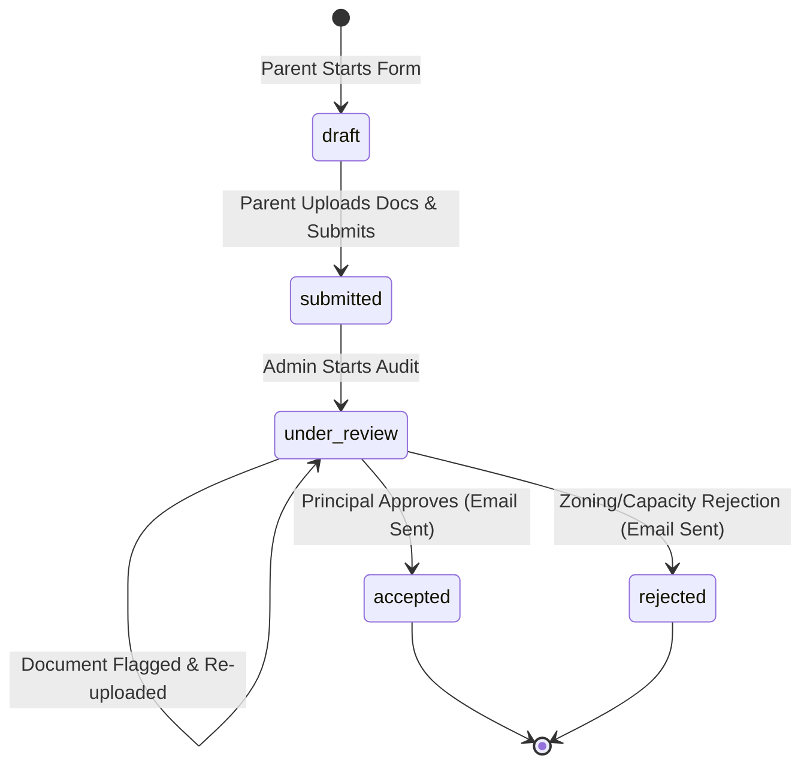

# Admissions Workflow Assessment & Requirement Analysis

**Document Status:** FINALIZED  
**Date:** May 20, 2026  
**Context:** Sprint 3 & 4 Workflow Discovery  
**Case Study:** Eunice High School Admissions Ingestion

---

## 1. Current State Workflow (Manual Process)

Through system discoverability assessments, the legacy admissions process is characterized by high operational friction and fragmented communication streams:

```
[Parent] ──(1. Google Form Submit)──► [Google Sheet DB]
  ▲                                         │
  │                                   (2. Manual Audit)
  │                                         ▼
  └─(4. Send scan via Email)◄──(3. Missing Docs Alert)◄── [Admissions Officer]
                                                            │
                                                      (5. Outcome Choice)
                                                            ▼
[Parent] ◄───────(6. Outcome Email Notification)────────────┘
```

### Legacy Workflow Step-by-Step:
1. **Initial Submission:** Parents input standard bio-data into Google Forms. Documents are uploaded as un-structured attachments into a Google Drive folder.
2. **First Audit:** The Admissions Officer reviews the Google Sheet row-by-row and matches it against Google Drive files.
3. **The Email Tag Loop:** If a birth certificate is missing or a report scan is unreadable, the officer writes a manual email to the parent.
4. **Correction Upload:** The parent responds by emailing raw attachments back to the officer's personal school mailbox.
5. **Outcome Determination:** Once complete, applications are evaluated. The officer manually updates outcome columns in the Google Sheet and drafts custom outcome letters.

---

## 2. Core Administrative Pain Points

Our analysis identifies three principal operational bottlenecks that the new platform must remediate:

### A. The "Email Tag" Bottleneck (High Severity)
Admissions staff spend **35-45% of their daily time** writing individual emails chasing parents for correct documents. This leads to backlogs, lost files, and delayed decisions.

### B. High Call/Inquiry Volume (Medium Severity)
Because parents have **zero visibility** into where their application stands, they constantly telephone or email the school office to ask: *"Did you receive my report?"* or *"Is my child accepted?"*. This interrupts core educational operations.

### C. Compliance & Privacy Concerns (High Severity)
Legacy document ingestion via email inboxes and public Google Drive shares violates **South Africa's Protection of Personal Information Act (POPIA)**. Child biometric and demographic data must be secured under strict RLS, audit logs, and automatic expiration timelines.

---

## 3. Core Workflow Roles & Stakeholder Mapping

To guide page layout construction in Sprint 4, we partition the platform into three primary user roles:

| Role | Key Focus | Critical Screens Used |
|:---|:---|:---|
| **Parent** | Low friction, mobile-first guided application; transparent tracking. | Signup/Signin, Guided Admission Form, Document Upload Modal, Status Tracker Dashboard. |
| **Admissions Officer** | High-velocity checklist auditing; bulk filters; communication templates. | Application Evaluator Grid, Document Review Pane, Notes & Communications log. |
| **School Principal** | High-level capacity analysis; final decision-making power. | Overview Stats Cards, Capacity Dashboard, Final Outcome Mutators (Accept/Reject). |

---

## 4. Platform State Machine (System Application States)

The Eunice Platform replaces manual tracking with an explicit state machine enforced at the database level:



### Transition Specifications:
1. **`draft`:** Application data exists but is editable. Not visible to the admin evaluation queue.
2. **`submitted`:** Parent locks the form. Initial bio-data is compiled and files uploaded. It enters the admin review queue.
3. **`under_review`:** School officer begins file auditing. Discrepancies may hold it in this state.
4. **`accepted` / `rejected`:** Final outcomes determined by Principal. Transitions automatically lock the application and trigger email alerts.
