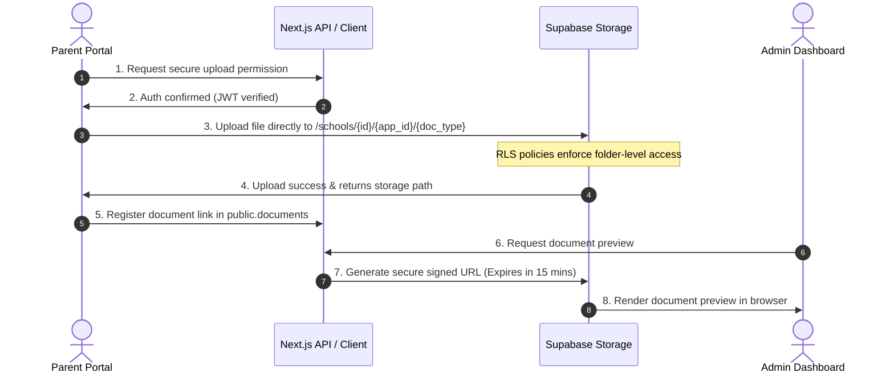

# Architectural Decision Record (ADR): Document Handling Spike

**Status:** APPROVED  
**Date:** May 20, 2026  
**Context:** Phase 1 (Sprint 3) Tech Decision  
**Focus:** Secure, compliant, and reliable document uploads for school admissions.

---

## 1. Executive Summary

Learners applying for school admission must submit critical supporting documents (e.g., Birth Certificates, Academic Reports, Parent Identity Documents, and Proof of Residence). This spike evaluates and defines the technology stack, validation mechanics, visual data flow, and **POPIA compliance** requirements for managing these sensitive assets.

We have decided to proceed with **Supabase Storage** as the primary object store for the Eunice School Intake Platform.

---

## 2. Storage Solution Comparison

| Metric / Feature | Supabase Storage (Selected) | AWS S3 | Google Cloud Storage |
|:---|:---|:---|:---|
| **Auth Integration** | Native. Shared JWT / RLS Policies. | Complex. Requires IAM roles / STS tokens. | Complex. Requires service account keys. |
| **API Overhead** | Zero. Integrated with existing JS client. | Medium. Requires `@aws-sdk/client-s3`. | Medium. Requires `@google-cloud/storage`. |
| **Security Model** | Database-level SQL Policies (RLS). | IAM / Bucket Policies. | IAM / ACL Policies. |
| **Cost (Free Tier)** | 1 GB free (sufficient for MVP pilot). | 5 GB free (for 12 months). | 5 GB free. |
| **Developer UX** | 🚀 Excellent. High-velocity setup. | ⚙️ High complexity. | ⚙️ High complexity. |

### Decision Rationale:
Supabase Storage is selected because it fully leverages our existing database infrastructure. Security is enforced natively using database SQL policies (Row-Level Security), completely eliminating the need to manage external credentials or construct intermediary API translation layers.

---

## 3. Document Validation Rules

To prevent server exploitation, format corruption, and excessive bandwidth consumption, we implement a **dual-layer validation architecture**:

```
[Parent Browser]                               [Supabase Storage Engine]
  ├─ 1. Client-Side Checks (Instant Feedback)
  │    ├─ MIME Type Check (PDF, PNG, JPG)
  │    └─ File Size Check (< 5MB)
  ▼
[Upload Pipeline]
  ▼
  └─ 2. Database & RLS Guards (Server-Side)
       ├─ JWT Auth Check (Must be logged in)
       ├─ Metadata Inspection (MIME matches allowed list)
       └─ Size Limits enforced by Bucket Constraints
```

### Validation Specifications:
1. **Allowed MIME Types:**
   * `application/pdf` (.pdf)
   * `image/png` (.png)
   * `image/jpeg` (.jpg, .jpeg)
2. **File Size Limitation:** 
   * **Max 5MB per file**. This ensures parents can upload clear, readable scans while avoiding network timeouts on standard South African mobile connections.
3. **MIME Spoofing Guard:** Client-side validation checks the extension, and the server-side bucket options enforce strict content-type verification.

---

## 4. Secure Lifecycle & Data Flow



---

## 5. POPIA Compliance & Privacy Guards

As South African public and private schools handle child data, the platform is strictly subject to the **Protection of Personal Information Act (POPIA)**.

### A. Data Security at Rest and Transit
* **Transit:** All files are transmitted via HTTPS encrypted with TLS 1.3.
* **Rest:** Documents are stored in encrypted Supabase Storage volumes (AES-256).

### B. Row-Level Security (RLS) Policies
Access to documents is strictly partitioned:
```sql
-- 1. Parents can only upload and view documents linked to their own applications
CREATE POLICY "Parents can manage their own documents" ON storage.objects
    FOR ALL TO authenticated
    USING (
        bucket_id = 'admissions_documents' AND
        (storage.foldername(name))[2] IN (
            SELECT id::text FROM public.applications WHERE parent_id = auth.uid()
        )
    );

-- 2. School Admins can read documents submitted to their school only
CREATE POLICY "Admins can view their school's documents" ON storage.objects
    FOR SELECT TO authenticated
    USING (
        bucket_id = 'admissions_documents' AND
        (storage.foldername(name))[1] = (
            SELECT school_id::text FROM public.profiles WHERE id = auth.uid()
        )
    );
```

### C. Data Retention & Right to be Forgotten
* **Automatic Purging:** When an application is deleted, rejected, or completed and past its statutory retention window (typically 5 years for school registers), a background database trigger will immediately hard-delete the corresponding files from the Supabase Storage bucket.
* **Orphan Prevention:** Deleting a record from `public.documents` triggers an edge function to clean up the physical file from the storage bucket.
