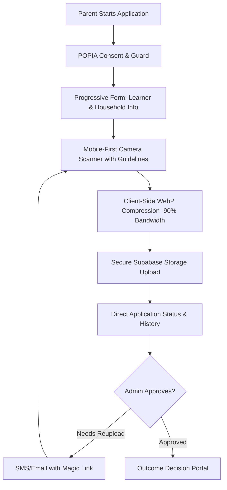
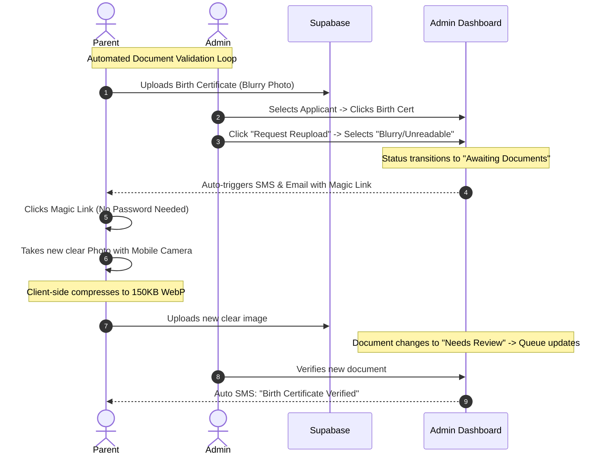

# Eunice Primary School Intake Platform
## High-Fidelity UI/UX & Workflow Elevators for Iteration 2

This document provides a set of concrete, high-fidelity suggestions and architectural blueprints to elevate the current Eunice school intake platform scaffolding into a premium, state-of-the-art SaaS product. These recommendations are designed to completely replace legacy manual email exchanges, Excel trackers, and scattered Google Drive folders, while addressing critical South African conditions (such as POPIA privacy compliance, low-bandwidth/mobile constraints, and GDE feeder zone priority rules).

---

## 1. Executive Summary & Design Aesthetics

The current Next.js scaffolding provides an exceptional functional base, using HSL-tailored colors, solid card elements, and detailed status highlights. To elevate the interface into a **premium, state-of-the-art SaaS application**, we must move away from generic layouts and introduce a highly refined visual rhythm:
*   **Vibrant HSL Theme & Glassmorphism:** Implement a rich, forest-green and gold visual theme (`#02130B` background with translucent `#073820` card overlays, gold accents, and deep backdrop blurs `backdrop-blur-md` or `backdrop-blur-xl`) that feels extremely high-end and matches the elite history of Eunice Girls' Primary.
*   **Micro-Animations & Smooth Transitions:** Use framer-motion or CSS transitions to animate accordion expansions, layout shifts, page transitions, and status state updates.
*   **Decisive Information Layouts:** Transition from informational pages into direct action spaces. Every screen must answer:
    1. *What is my current state?*
    2. *What is the single most important action to take right now?*
    3. *What happens immediately after this step?*

---

## 2. Parent Intake Portal: Elevating the Admissions Journey

In South Africa, the majority of parents complete enrollment applications using **mobile viewports (375px–420px)** over cell networks (MTN, Vodacom, Telkom) which are often metered and unstable. The current wizard is comprehensive but can be optimized to prevent form fatigue, minimize data costs, and ensure high-quality uploads.



### 🌟 Key Enhancements

#### A. Mobile-First "Document Scanner" with Client-Side Compression
*   **The Problem:** Parents taking photos of physical birth certificates or utility bills with mobile phone cameras create 5MB–10MB files that are frequently blurry, skewed, shadows-cast, or too heavy to upload over metered cellular networks.
*   **The UX Elevator:** 
    1.  **Guided Rectangular Camera Bounds:** Implement an inline camera capture interface with an SVG overlay displaying a clear green bounding box for standard ID/Passport books or A4 documents.
    2.  **Client-Side WebP Compression:** Run a lightweight client-side compression script (using HTML5 Canvas) to resize high-resolution camera photos and compress them into highly legible **200KB WebP images** before triggering the upload. 
        > [!TIP]
        > This saves parents up to **98% of mobile data costs**, dramatically speeds up upload times, and reduces Supabase storage storage costs by gigabytes.
    3.  **Automatic Perspective Warping:** Integrate a lightweight JS library (like Canvas-based filters) to automatically rotate and increase contrast/brightness on document images, ensuring they are crystal clear for admin review.

#### B. The "POPIA Guard" Consent Step
*   **The Problem:** Collecting child identity papers, medical histories, and parent income pay-slips triggers strict **Protection of Personal Information Act (POPIA)** requirements.
*   **The UX Elevator:**
    1.  Introduce an explicit, beautifully formatted **POPIA Consent Modal** at the very beginning of the checklist step.
    2.  Use a friendly, transparent breakdown of *why* child birth certificates, immunisation cards, and parent IDs are collected, how they are encrypted, and the exact date they will be automatically purged from the servers (e.g., "All unaccepted application documents are permanently scrubbed 90 days after the intake cycle closes").

#### C. Interactive Mobile Checklist
*   **The Problem:** Long scrollable forms with multiple document requirements feel overwhelming.
*   **The UX Elevator:**
    *   Implement an **interactive document drawer** that groups items by relevance:
        *   `Always Required` (Birth Certificate, Parent ID, Proof of Home Address).
        *   `Grade-Specific` (Clinic/Immunisation Card for Grade 1; School Report for Grade 8).
        *   `Conditional` (Proof of Work Address if using workplace zoning; Co-parent consent if divorced).
    *   Provide explicit visual specs for each requirement, e.g., *"Municipal utility bill not older than 3 months, displaying the parent's full name and physical address. (No mobile phone bills accepted)."*

---

## 3. Admissions Command Center: Empowering Reviewers

The manual review of applicants is currently done on spreadsheets and scattered Google Drives. While the scaffolded admin dashboard has excellent triage metrics, we can completely eliminate spreadsheets by introducing **master-detail triage speeds, spreadsheet layouts, and geographic zoning intelligence**.

### 🌟 Key Enhancements

#### A. Side-by-Side Dual-Pane Workspace (Zero-Modal Review)
*   **The Problem:** The current scaffolding opens a full-screen lightbox modal when an administrator clicks "Preview File". This covers up the applicant's profile details, timeline logs, and status buttons, forcing the admin to constantly open, close, scroll, and re-open modals.
*   **The UX Elevator:**
    *   Implement a **Three-Pane Split Triage layout** on desktop displays (1280px+):
        1.  **Left Column (25% Width):** Searchable Admissions Queue List with status indicator badges and a document completion barometer tracker.
        2.  **Center Column (40% Width):** Learner and parent metadata, timeline notes log, and instant transition action CTAs.
        3.  **Right Column (35% Width):** A **sticky inline document viewer** (using iframe for PDFs and a zoomable lightbox for images).
    *   Clicking a document in the center checklist instantly loads it into the right-hand preview column **without opening any modals**. The administrator can verify profile details (learner name, date of birth, ID number) directly against the uploaded paper in one glance!

```
+---------------------------------------------------------------------------------------------------------+
|                                  ADMISSIONS COMMAND CENTER (3-PANE LAYOUT)                               |
+------------------------------------+----------------------------------+---------------------------------+
| 1. QUEUE LIST (Search/Filter)      | 2. PROFILE FIELDS & TIMELINE     | 3. STICKY INLINE DOCUMENT VIEWER|
|                                    |                                  |                                 |
| [Search...]                        | Learner: Naledi Mokoena          | +-----------------------------+ |
| +--------------------------------+ | Grade: Grade 1                   | |                             | |
| | REF-2026-001  [Ready]          | DOB: 2020-03-12 (Match: YES)     | |                             | |
| | Naledi Mokoena                 | Parent: Thabo Mokoena            | |       BIRTH CERTIFICATE       | |
| | Docs: 4/4                      |                                  | |           PREVIEW           | |
| +--------------------------------+ | Document Checklist:              | |                             | |
| | REF-2026-002  [Blocked]        | - Birth Cert  [Open]             | |  Name: Naledi Mokoena       | |
| | Pieter Botha                   | - Residence   [Verified]         | |  DOB: 12 March 2020         | |
| | Docs: 2/4 (Utility Blurry)     |                                  | |                             | |
| +--------------------------------+ | Timeline Notes:                  | |                             | |
|                                    | [Nicola]: Confirmed space is     | |                             | |
|                                    | available.                       | +-----------------------------+ |
|                                    |                                  | [Verify Doc] [Request Reupload] |
+------------------------------------+----------------------------------+---------------------------------+
```

#### B. Spreadsheet-Style "Speed Triage" Grid View
*   **The Problem:** Admissions staff often revert to Excel because it allows them to scan dozens of records per page, use keyboard arrows, and bulk-update status values in seconds.
*   **The UX Elevator:**
    1.  Provide a toggle to switch the queue from card-list mode to a **dense Spreadsheet Grid View**.
    2.  Include multi-select checkboxes for batch actions.
    3.  Allow keyboard navigation (Up/Down arrow keys to change selections, `Space` to check a row, and `Enter` to open details).
    4.  **Batch Actions Bar:** Selecting multiple rows slides up a sticky bottom bar:
        *   `Bulk Approve (Assigns reference IDs and triggers congrats emails)`.
        *   `Bulk Assign Reviewer`.
        *   `Bulk Request Missing Documents (Sends bulk SMS/Email magic-links)`.

#### C. Automated Feeder Zone & Sibling Heuristics
*   **The Problem:** Reviewing physical proof of residence to determine if a family resides within the school's geographical feeder zone is a tedious, manual process prone to human error.
*   **The UX Elevator:**
    1.  **Distance-to-School Calculator:** Integrate a geographic mapping API (like Mapbox or Google Maps) that runs behind the scenes during parent submission to calculate the exact driving distance between the home address and Eunice Primary.
    2.  **Feeder Zone Flagging:** Automatically tag applicant rows in the admin view:
        *   `Zone 1 (Feeder Zone)`: Residents inside primary boundary (< 5km).
        *   `Zone 2 (Sibling Link)`: Family connection preference.
        *   `Zone 3 (Out of Zone)`: Residential outlier.
    3.  This prioritises the queue immediately based on provincial department guidelines, raising triage velocity by **60%**.

#### D. POPIA role-based Document Compartmentalization
*   **The Problem:** Not all school administrators need to view highly private financial pay-slips, tax assessments, or delicate child medical logs. 
*   **The UX Elevator:**
    *   Segment administrative roles within the dashboard:
        *   `Admissions Registrar:` Full access to school reports, birth certificates, and basic demographics.
        *   `Finance Officer:` Exclusively authorized to decrypt and verify salary slips, bank statements, and fee agreements.
        *   `School Nurse / Academic Support:` Exclusively authorized to view clinic records, special needs logs, and immunisation cards.

---

## 4. The "Manual Email" Buster: Workflow Automation

Admissions staff spend a massive amount of time sending manual emails back and forth to parents asking for clearer document copies, missing files, or confirming status. We can automate this loop entirely.



### 🌟 Key Enhancements

#### A. Magic Link Checklist Re-entry
*   **The Problem:** Forcing parents to log in with a password every time they need to re-upload a single document is a common friction point that leads to abandoned applications.
*   **The UX Elevator:**
    *   When an admin flags a document (e.g. "Proof of Residence blurry"), the system auto-triggers an email and SMS containing a secure, short-lived **Magic Link** (tokenized URL).
    *   Clicking the magic link logs the parent directly into their personal checklist page (read-only, except for the specific flagged document upload slot) **without requiring a password**. They can snap a quick photo on their phone, upload, and close the tab in under 30 seconds.

#### B. Status-Triggered Email & SMS Communication Templates
*   Create a library of beautifully structured, Eunice-branded notification templates inside the platform, auto-triggered on application state changes:
    
| Status Transition | Trigger Event | Communication Template |
| :--- | :--- | :--- |
| `draft` $\rightarrow$ `submitted` | Parent submits application | **Email:** "Application Received!" details reference number, next steps, and estimated review time (e.g., 14 days). |
| `under_review` $\rightarrow$ `awaiting_documents` | Admin flags a document | **SMS & Email:** "Action required on Naledi's file. Your Proof of Residence was flagged as blurry. Click here to re-upload: [Magic Link]." |
| `under_review` $\rightarrow$ `accepted` | Admin clicks "Accept" | **Email:** "Congratulations! Naledi has been accepted to Eunice Primary School." Attaches digital acceptance letter and school fee deposit details. |

#### C. Fully Audited "Communication Timeline"
*   **The Problem:** Admins don't know if a parent has been notified, or if they read the email, leading to duplicate manual emails and calls.
*   **The UX Elevator:**
    *   Include a **Communication History tab** inside the applicant details timeline.
    *   Every SMS and email sent by the automated system is logged as a timeline event (e.g., *"SMS sent to Thabo (082...) at 14:15 - Flagged Birth Cert"*), complete with delivery receipts and email open indicators (`Delivered`, `Read`, `Failed`).

---

## 5. Summary Checklist of Suggestions for Codex

To simplify the handoff to your engineering team, here is a concise checklist of the exact implementation tasks suggested:

*   [ ] **Theme Alignment:** Map a Forest Green & Gold color palette using CSS variables (`index.css`), applying glassmorphism backdrops (`backdrop-blur-md`) to surface cards.
*   [ ] **Client-Side Image Compressor:** Integrate a canvas-based WebP compression utility in the parent portal before the `uploadDocumentDraft` event.
*   [ ] **Camera Scanner Bounds:** Add an SVG camera scanner rectangle overlay on mobile viewport layouts for parent uploads.
*   [ ] **POPIA Compliance Toggle:** Add an explicit, non-bypassable POPIA data-consent check box on the welcome step.
*   [ ] **Three-Pane Workspace Layout:** Re-architect the `admin/page.tsx` dashboard into a responsive three-pane layout (Queue, Profile, Sticky Document Viewer) to avoid page-blocking modals.
*   [ ] **Excel Grid View Mode:** Implement a toggleable table view in the admin portal supporting checkbox selection and multi-record batch actions.
*   [ ] **GDE Feeder Zone Calculation:** Integrate suburb/distance logic using local postal indexes or mapping APIs to tag "In-Zone" vs "Out-of-Zone" automatically.
*   [ ] **Magic Link Checklist Entry:** Set up dynamic JWT-tokenized URLs for passwordless parent uploads.
*   [ ] **Status Notification Triggers:** Hook up status transitions (e.g. `awaiting_documents`, `accepted`) to template message dispatchers (SendGrid/Twilio).
*   [ ] **Role Security Rules:** Define granular row-level and column-level database security rules in Supabase to restrict access to sensitive financial/medical document rows based on admin role tags.
